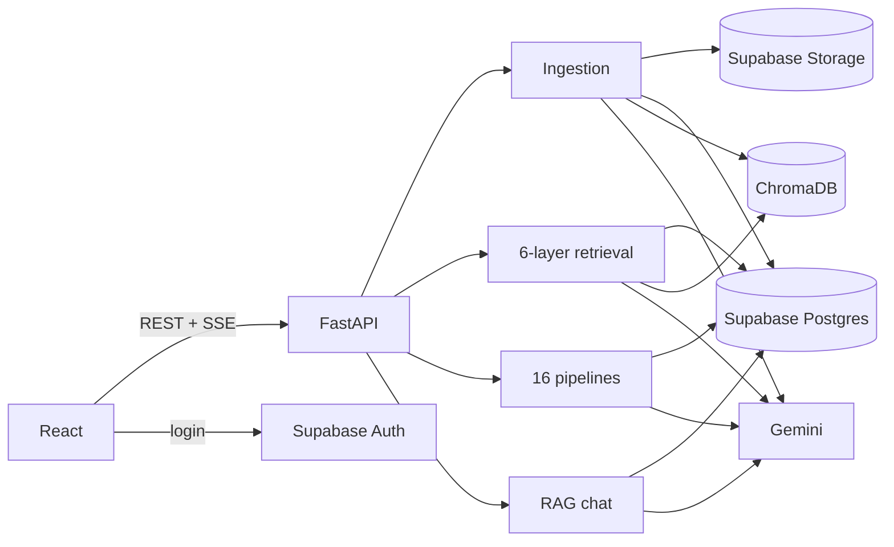

# StudyForge

**AI-powered document-to-learning platform.** Upload lecture notes, PDFs, Word files, slide photos or recordings. StudyForge turns them into **16 kinds of personalised study material** and a chat assistant that answers **only from your documents, with page-level citations**.


<!-- Screenshot/GIF placeholder: add docs/screenshot.png after the first real run. -->

| | |
|---|---|
| **Frontend** | React 19 + Vite, React Query, Mermaid |
| **Backend** | FastAPI (Python 3.12) |
| **LLM** | Google Gemini 2.5 Flash (config value), structured JSON output |
| **Embeddings** | Gemini `gemini-embedding-001` (768-d) |
| **Vector DB** | ChromaDB (embedded, cosine HNSW) |
| **Database / Auth / Files** | Supabase Postgres (RLS) · Supabase Auth · Supabase Storage |

## What it does

- **Ingestion:** PDF (pymupdf4llm, with Gemini OCR for scanned pages), DOCX, TXT/MD, images (OCR) and audio (transcription). A recursive, section-aware chunker makes ~600-token chunks with 15% overlap. Contextual chunk headers are added before embedding. Ingestion is idempotent (SHA-256), runs in the background, and exposes its status so the UI can poll.
- **Multi-layer retrieval:** scope filter → dense search (Chroma) + BM25 → Reciprocal Rank Fusion → MMR diversification (+ optional LLM rerank) → token-budgeted context with `[S#]` citation labels. Follow-up questions are rewritten into standalone queries.
- **16 pipelines:** summary, key concepts, FAQ, MCQ quiz, flashcards, exam notes, study guide, outline, mind map, glossary, timeline, practice problems, simple explanation, compare & contrast, podcast script, textbook chapter.
  - Each is personalised by difficulty, length and focus topic.
  - Output is schema-validated JSON with one automatic repair.
  - Results are cached per (notebook, pipeline, params, sources version).
- **RAG chat:** answers stream token by token over Server-Sent Events and cite every factual sentence. If the documents don't contain the answer, it says so.

## Architecture



Step-by-step request flows: [docs/ARCHITECTURE.md](docs/ARCHITECTURE.md) · API: [docs/API.md](docs/API.md) · Design decisions: [docs/DECISIONS.md](docs/DECISIONS.md)

## Retrieval evaluation

33 labelled questions over 3 documents (`backend/eval/`). The metrics are Recall@k and MRR, computed by `python -m eval.run_eval`.

> Results table: see [`backend/eval/results.md`](backend/eval/results.md). *(Generated by the eval script with real Gemini embeddings. No number is written here by hand.)*

## Run it locally

Full guide: **[docs/SETUP.md](docs/SETUP.md)**. Quick start in demo mode, which needs only a Gemini key and no Supabase:

```bash
cd backend
python -m venv .venv && .venv/Scripts/activate        # Windows (macOS/Linux: source .venv/bin/activate)
pip install -r requirements-dev.txt
cp .env.example .env                                   # set GEMINI_API_KEY
uvicorn app.main:create_app --factory --reload --port 8080
```

```bash
cd frontend
npm install
npm run dev                                            # http://localhost:5173
```

Tests (no API key needed): `cd backend && pytest` · `cd frontend && npm test`

## Documentation

| Doc | What's in it |
|---|---|
| [docs/SETUP.md](docs/SETUP.md) | Keys, Supabase setup, running, troubleshooting |
| [docs/STUDY_GUIDE.md](docs/STUDY_GUIDE.md) | How every part works, trade-offs, interview Q&A, viva script |
| [docs/ARCHITECTURE.md](docs/ARCHITECTURE.md) | Request flows with file/function names |
| [docs/DECISIONS.md](docs/DECISIONS.md) | Why each technology/design was chosen |
| [docs/API.md](docs/API.md) | REST + SSE contract |
| [docs/DEPLOY_GCP.md](docs/DEPLOY_GCP.md) | Cloud Run deployment notes |
| [docs/V1_AUDIT.md](docs/V1_AUDIT.md) | What v1 did and what v2 changed |

## History

- **v1 (viva version)** used Go + Gin + LangChainGo + SQLite, with keyword-based retrieval over in-memory chunks and a vanilla-JS UI. It's preserved in [`legacy-go/`](legacy-go) and at git tag [`v1-go`](https://github.com/Lukey-7/StudyForge/tree/v1-go).
- **v2 (this version)** is a rewrite to React + FastAPI + ChromaDB + Supabase with real embeddings, hybrid retrieval, structured pipelines, streaming cited chat, tests and CI.

## License

See [LICENSE](LICENSE).
