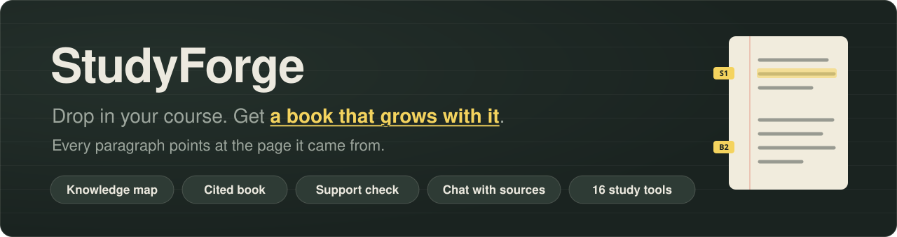
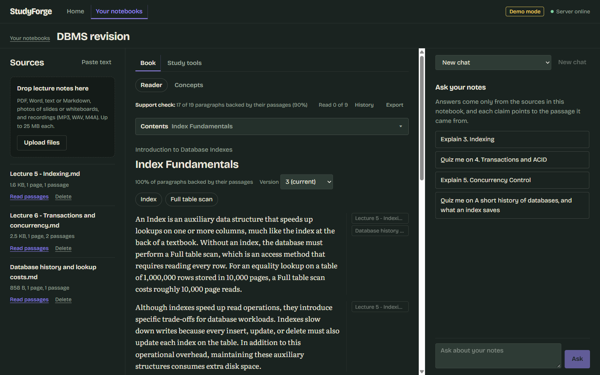
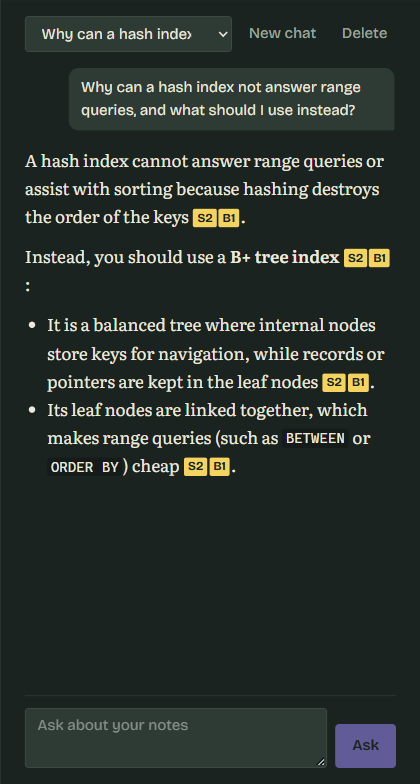
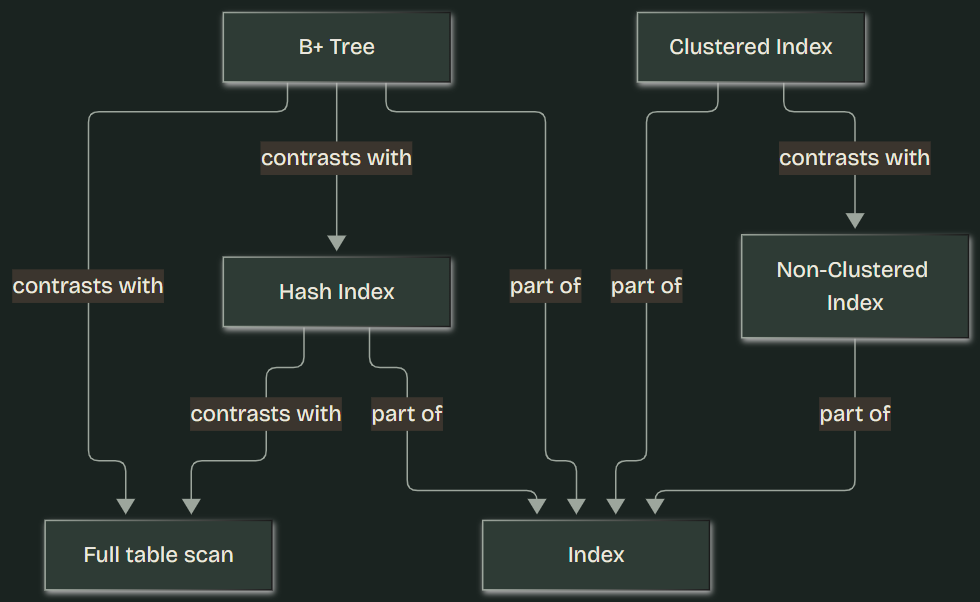
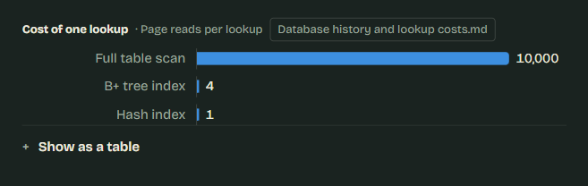
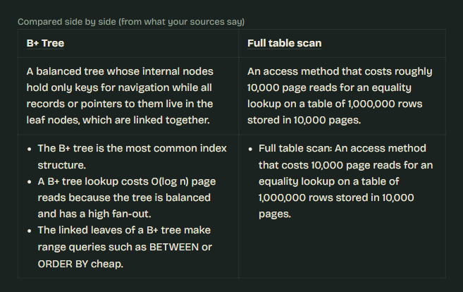
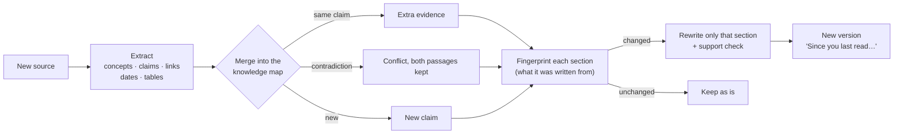
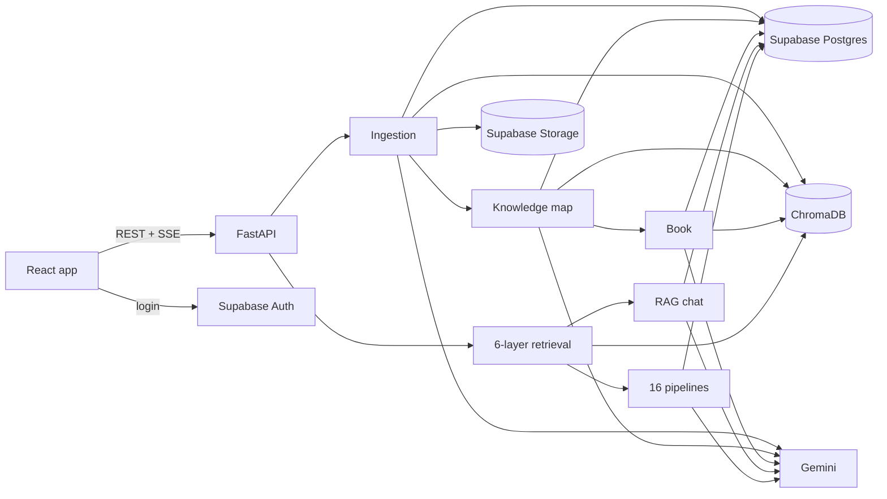

<p align="center">
  
</p>

<p align="center">
  <a href="https://github.com/Lukey-7/StudyForge/actions/workflows/ci.yml"></a>
  
  
  
  
  
  
</p>

**StudyForge turns a pile of course material into one living textbook.** Drop in lecture notes, PDFs, Word files, slide photos or recordings. It reads all of them into a **knowledge map** (concepts, claims and the passages behind each claim) and writes **one book per notebook**. Every paragraph points at the page it came from. Add a source and the book **grows**: only the sections it touches are rewritten. Around the book you get a chat that answers only from your sources, and 16 study tools.

<p align="center">
  
  <br><sub>The workspace. Sources on the left, the book in the middle (every paragraph lists the passages it came from, here from two different sources), and chat on the right.</sub>
</p>

## What it does

| | |
|---|---|
| 📚 **A living textbook** | Chapters in prerequisite order, written from your sources. Glossary terms show their definition on hover, and each paragraph has an evidence rail that opens the exact passage. The book tells you what changed since you last read it. |
| 🧠 **Knowledge map** | Concepts are merged across sources (with an embedding shortlist and an LLM check), so a term three sources define is one entry with three pieces of evidence. Repeated claims become extra evidence, and contradictions become visible conflicts, never silent overwrites. |
| ✅ **Support check** | A second model call judges every paragraph against the passages it cites. Unsupported paragraphs are rewritten once, then kept with a visible mark. On a real notebook: **37 of 39 paragraphs supported (95%)**, a self-check reported as such. |
| 📈 **Figures drawn by code** | Concept maps, comparison tables, timelines (from dates the sources state) and bar charts (from tables of numbers in the sources). The LLM never draws. |
| 💬 **Chat with citations** | Six-layer hybrid retrieval, streamed answers, `[S#]` for source passages and `[B#]` for book sections. If your sources don't say it, it says so. |
| 🧩 **16 study tools** | Summary, quiz, flashcards, mind map, exam notes, study guide and more. Each is personalised by difficulty, length and focus, and schema-validated. |
| 🎯 **Learning loop** | Reading progress, "Quiz me on this chapter" feeding weak spots, "Explain this section" more simply or step by step, and search by meaning across every notebook. |
| 📤 **Export** | Markdown with footnote citations, EPUB, or print / save as PDF. |

<table>
  <tr>
    <td width="42%" valign="top">
      
      <br><sub><b>Chat</b> answers only from your notes, citing the passage <code>S2</code> and the book section <code>B1</code>. Click either to open it.</sub>
    </td>
    <td width="58%" valign="top">
      
      <br><sub><b>Concept map</b> of a chapter: the links between concepts (<i>part of</i>, <i>contrasts with</i>) from the knowledge map, drawn by code.</sub>
      <br><br>
      
      <br><sub><b>Chart</b> built from a table of numbers in a source (full scan 10,000 page reads, B+ tree 4, hash index 1), linked to that source.</sub>
    </td>
  </tr>
</table>

<p align="center">
  
  <br><sub><b>Compared side by side:</b> generated from a "contrasts with" link, with what each source says about both sides.</sub>
</p>

## How the book grows



Measured on a real notebook:
- Adding a second source left **6 of 7 sections untouched**, revised 1 and added a 4-section chapter.
- A third source left **all 11 untouched** and added 5.
- A fourth, with dates and a table, added a timeline and a chart.

## Architecture



| Layer | Stack |
|---|---|
| **Frontend** | React 19 + Vite, React Query, React Router, Mermaid, react-markdown |
| **Backend** | FastAPI (Python 3.12), Pydantic, background jobs with per-notebook locks |
| **LLM** | Google Gemini 3.8 Flash, structured JSON output validated by Pydantic (optional OpenAI fallback) |
| **Embeddings** | Gemini `gemini-embedding-001` (768-d) for passages, concepts, claims and book sections |
| **Search** | ChromaDB (embedded, cosine HNSW) + BM25, fused with Reciprocal Rank Fusion, MMR, LLM rerank |
| **Data** | Supabase Postgres (row-level security on every table) · Supabase Auth · Supabase Storage |

**Postgres is the source of truth.** Chroma is an index that can be rebuilt from it at any time (`python -m scripts.reindex`, or automatically at startup with `REINDEX_ON_START`).

The whole app, step by step: **[docs/HOW_IT_WORKS.md](docs/HOW_IT_WORKS.md)**.

## Retrieval evaluation

33 labelled questions over 3 documents ([`backend/eval/results.md`](backend/eval/results.md), `gemini-embedding-001`, rerank by `gemini-3.8-flash`):

| Retrieval mode | Recall@1 | Recall@5 | MRR@10 |
|---|---|---|---|
| Dense only (Chroma) | 0.82 | 0.97 | 0.89 |
| BM25 only | 0.91 | 0.97 | 0.94 |
| Hybrid (RRF) | 0.82 | 1.00 | 0.90 |
| Hybrid (RRF) + MMR | 0.82 | 1.00 | 0.90 |
| **Hybrid + MMR + LLM rerank** (default) | **1.00** | **1.00** | **1.00** |

- The LLM rerank layer takes the first result from right ~82% of the time to 100%, which is why it is on by default.
- The set is small, so read the table as a comparison between layers, not an absolute quality claim.

The book's support check is reported separately in [`backend/eval/book_support.md`](backend/eval/book_support.md).

## Run it locally

Full guide: **[docs/SETUP.md](docs/SETUP.md)**. The quick start below is demo mode: it needs only a Gemini key, no Supabase.

```bash
cd backend
python -m venv .venv && .venv/Scripts/activate        # Windows (macOS/Linux: source .venv/bin/activate)
pip install -r requirements-dev.txt
cp .env.example .env                                   # set GEMINI_API_KEY
uvicorn app.main:create_app --factory --reload --port 8080
```

```bash
cd frontend
npm install
npm run dev                                            # http://localhost:5173
```

Tests need no API key: `cd backend && pytest` (140 tests) · `cd frontend && npm test` (30 tests).

**Deployable as is.** On every push, CI builds the production Docker image, starts it and checks `/health`. The deploy options (Render blueprint, Cloud Run, any Docker host, frontend on GitHub Pages) are in [docs/DEPLOY.md](docs/DEPLOY.md).

## Documentation

| Doc | What's in it |
|---|---|
| [docs/HOW_IT_WORKS.md](docs/HOW_IT_WORKS.md) | **Start here:** the whole app, tech stack, code layout, data model, what happens step by step |
| [docs/SETUP.md](docs/SETUP.md) | Keys, Supabase setup, running, troubleshooting |
| [docs/LIVING_TEXTBOOK_PLAN.md](docs/LIVING_TEXTBOOK_PLAN.md) | The knowledge map and the book: design, phases, decisions |
| [docs/ARCHITECTURE.md](docs/ARCHITECTURE.md) | Request flows with file and function names |
| [docs/API.md](docs/API.md) | REST + SSE contract |
| [docs/DECISIONS.md](docs/DECISIONS.md) | Why each technology and design was chosen |
| [docs/DEPLOY.md](docs/DEPLOY.md) | Deploying the backend and the frontend |
| [docs/STUDY_GUIDE.md](docs/STUDY_GUIDE.md) | How every part works, trade-offs, interview Q&A, viva script |
| [frontend/DESIGN.md](frontend/DESIGN.md) | The "chalkboard and highlighter" design system |
| [docs/V1_AUDIT.md](docs/V1_AUDIT.md) | What v1 did and what v2 changed |

## History

- **v1 (the viva version)** used Go + Gin + LangChainGo + SQLite, with keyword retrieval over in-memory chunks and a vanilla-JS UI. It is kept in [`legacy-go/`](legacy-go) and at git tag [`v1-go`](https://github.com/Lukey-7/StudyForge/tree/v1-go).
- **v2 (this version)** is a rewrite to React + FastAPI + ChromaDB + Supabase: real embeddings, hybrid retrieval, structured pipelines, streaming cited chat, and the living textbook, with tests and CI.

## License

See [LICENSE](LICENSE).
