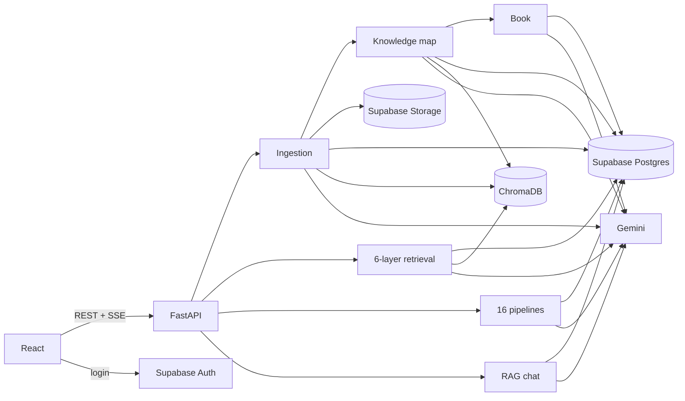

# StudyForge

**AI-powered document-to-learning platform.** Upload lecture notes, PDFs, Word files, slide photos or recordings. StudyForge turns them into **16 kinds of personalised study material** and a chat assistant that answers **only from your documents, with page-level citations**.


<!-- Screenshot/GIF placeholder: add docs/screenshot.png after the first real run. -->

| | |
|---|---|
| **Frontend** | React 19 + Vite, React Query, Mermaid |
| **Backend** | FastAPI (Python 3.12) |
| **LLM** | Google Gemini 3.8 Flash (`gemini-3.8-flash`, config value), structured JSON output |
| **Embeddings** | Gemini `gemini-embedding-001` (768-d) |
| **Vector DB** | ChromaDB (embedded, cosine HNSW) |
| **Database / Auth / Files** | Supabase Postgres (RLS) · Supabase Auth · Supabase Storage |

## What it does

- **Ingestion:** PDF (pymupdf4llm, with Gemini OCR for scanned pages), DOCX, TXT/MD, images (OCR) and audio (transcription). A recursive, section-aware chunker makes ~600-token chunks with 15% overlap. Contextual chunk headers are added before embedding. Ingestion is idempotent (SHA-256), runs in the background, and exposes its status so the UI can poll.
- **Multi-layer retrieval:** scope filter → dense search (Chroma) + BM25 → Reciprocal Rank Fusion → MMR diversification (+ optional LLM rerank) → token-budgeted context with `[S#]` citation labels. Follow-up questions are rewritten into standalone queries.
- **16 pipelines:** summary, key concepts, FAQ, MCQ quiz, flashcards, exam notes, study guide, outline, mind map, glossary, timeline, practice problems, simple explanation, compare & contrast, podcast script, textbook chapter.
  - Each is personalised by difficulty, length and focus topic.
  - Output is schema-validated JSON with one automatic repair.
  - Results are cached per (notebook, pipeline, params, sources version).
- **The living textbook (Book tab):** StudyForge reads every source into a **knowledge map**: concepts (glossary terms and named examples), atomic claims, and the passages behind each claim. Concepts are merged across sources, so a term defined by three sources is one entry with three pieces of evidence. A claim stated again becomes extra evidence, and a contradiction is recorded as a conflict rather than overwriting. From that map it writes **one book per notebook**: chapters ordered so prerequisites come first, every paragraph pointing at the passages it came from.
  - When a source is added, only the sections whose concepts changed are rewritten, and the reader shows "Since you last read: …". On a real notebook, adding a second source left 6 of 7 sections untouched, revised 1 and added a 4-section chapter.
  - Reader: contents, an evidence rail beside each paragraph, glossary terms with hover definitions, where the sources disagree, and the book's history. Plan and status: [docs/LIVING_TEXTBOOK_PLAN.md](docs/LIVING_TEXTBOOK_PLAN.md).
  - **Figures and export:**
    - A concept map per chapter and comparison tables, both drawn by code from the knowledge map.
    - Export as Markdown (with footnote citations and a glossary) or EPUB, or print / save as PDF.
  - **Learning tools:** reading progress, "Quiz me on this chapter" (low scores become weak spots), "Explain this section" more simply or step by step, and a search across all your notebooks. Chat also searches the book and cites sections as `[B1]`; clicking one opens the section.
  - **Support check:** a second call judges every paragraph against the passages it cites. Unsupported paragraphs are rewritten once, then kept with a visible mark. On the real notebook, 31 of 33 paragraphs were judged supported (94%), 2 partly ([eval/book_support.md](backend/eval/book_support.md); a self-check by the same model family).
- **RAG chat:** answers stream token by token over Server-Sent Events and cite every factual sentence. If the documents don't contain the answer, it says so. Click a citation to jump to the exact passage.
- **Study tools:** interactive quiz with "Retry the ones I missed", flashcards with Got it / Again self-rating, Mermaid mind maps, Copy as Markdown / Download / Export for Anki, suggested questions from your notes' headings. Design system: [frontend/DESIGN.md](frontend/DESIGN.md).

## Architecture



Step-by-step request flows: [docs/ARCHITECTURE.md](docs/ARCHITECTURE.md) · API: [docs/API.md](docs/API.md) · Design decisions: [docs/DECISIONS.md](docs/DECISIONS.md)

## Retrieval evaluation

33 labelled questions over 3 documents, 200-token chunks (33 chunks). Run with `cd backend && python -m eval.run_eval`. The full output is in [`backend/eval/results.md`](backend/eval/results.md) (run 2026-09-29, `gemini-embedding-001`, rerank by `gemini-3.8-flash`):

| Retrieval mode | Recall@1 | Recall@5 | MRR@10 |
|---|---|---|---|
| Dense only (Chroma) | 0.82 | 0.97 | 0.89 |
| BM25 only | 0.91 | 0.97 | 0.94 |
| Hybrid (RRF) | 0.82 | 1.00 | 0.90 |
| Hybrid (RRF) + MMR | 0.82 | 1.00 | 0.90 |
| **Hybrid + MMR + LLM rerank** (default) | **1.00** | **1.00** | **1.00** |

How to read this:
- **The LLM rerank layer is what moves the first result from right ~82% of the time to 100%.** That's why it's on by default.
- Hybrid fusion fixed dense's one Recall@5 miss (0.97 → 1.00) but did not improve rank 1 on this set.
- The set is small (33 questions, 33 chunks), so Recall@5 is near its ceiling, and a perfect score here does **not** mean perfect retrieval in general. Treat the table as a comparison between layers, not an absolute quality claim.
- The dense rows vary by about ±0.03 between runs.

## Run it locally

Full guide: **[docs/SETUP.md](docs/SETUP.md)**. Quick start in demo mode, which needs only a Gemini key and no Supabase:

```bash
cd backend
python -m venv .venv && .venv/Scripts/activate        # Windows (macOS/Linux: source .venv/bin/activate)
pip install -r requirements-dev.txt
cp .env.example .env                                   # set GEMINI_API_KEY
uvicorn app.main:create_app --factory --reload --port 8080
```

```bash
cd frontend
npm install
npm run dev                                            # http://localhost:5173
```

Tests (no API key needed): `cd backend && pytest` · `cd frontend && npm test`

## Documentation

| Doc | What's in it |
|---|---|
| [docs/HOW_IT_WORKS.md](docs/HOW_IT_WORKS.md) | **Start here:** the whole app, tech stack, code layout, data model, what happens step by step |
| [docs/SETUP.md](docs/SETUP.md) | Keys, Supabase setup, running, troubleshooting |
| [docs/STUDY_GUIDE.md](docs/STUDY_GUIDE.md) | How every part works, trade-offs, interview Q&A, viva script |
| [docs/ARCHITECTURE.md](docs/ARCHITECTURE.md) | Request flows with file/function names |
| [docs/DECISIONS.md](docs/DECISIONS.md) | Why each technology/design was chosen |
| [docs/API.md](docs/API.md) | REST + SSE contract |
| [docs/LIVING_TEXTBOOK_PLAN.md](docs/LIVING_TEXTBOOK_PLAN.md) | The knowledge map and book: design, phases, decisions |
| [docs/DEPLOY_GCP.md](docs/DEPLOY_GCP.md) | Cloud Run deployment notes |
| [docs/V1_AUDIT.md](docs/V1_AUDIT.md) | What v1 did and what v2 changed |

## History

- **v1 (viva version)** used Go + Gin + LangChainGo + SQLite, with keyword-based retrieval over in-memory chunks and a vanilla-JS UI. It's preserved in [`legacy-go/`](legacy-go) and at git tag [`v1-go`](https://github.com/Lukey-7/StudyForge/tree/v1-go).
- **v2 (this version)** is a rewrite to React + FastAPI + ChromaDB + Supabase with real embeddings, hybrid retrieval, structured pipelines, streaming cited chat, tests and CI.

## License

See [LICENSE](LICENSE).
