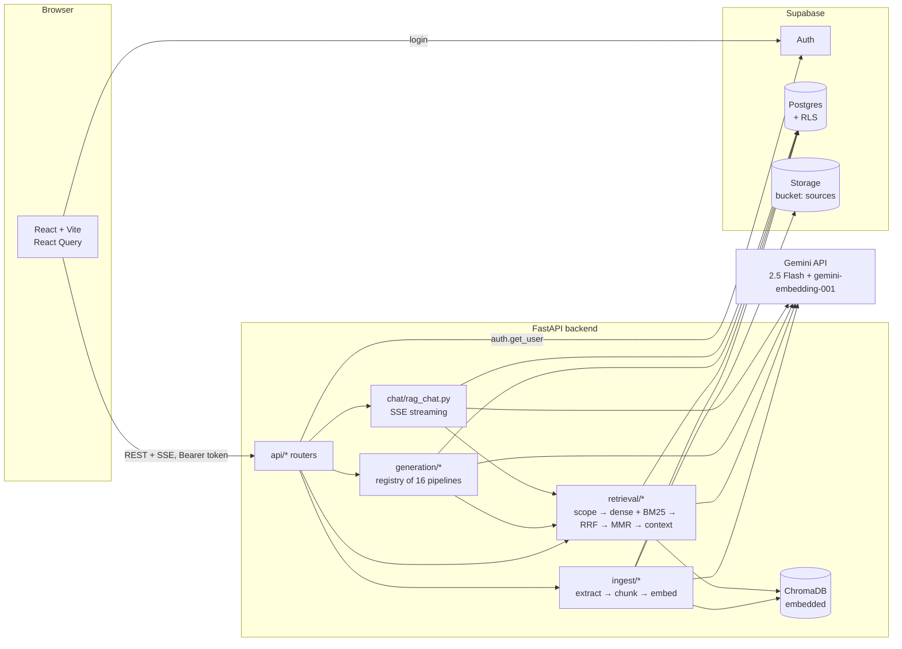

# Architecture

**Responsibilities**
- **Postgres:** source of truth: notebooks, sources, chunk text, generations, chat.
- **Chroma:** vectors + filter metadata only (rebuildable with `scripts/reindex.py`).
- **Storage:** original files.
- **Gemini:** generation, OCR, transcription and embeddings.

Every file/function named below is in `backend/app/` unless it starts with `frontend/`.

---

## (a) Upload a PDF

1. **Browser:** `frontend/src/components/SourcesPanel.jsx` → the `upload` mutation → `api()` in `frontend/src/lib/api.js` sends `POST /notebooks/{id}/sources` (multipart) with `Authorization: Bearer <supabase token>`.
2. **Auth:** `api/deps.py::get_user` → `auth.py::Authenticator.verify`, which calls Supabase `auth.get_user(token)` (cached 60 s) and returns `User(id, email)`. `ensure_profile` makes sure the profile row exists.
3. **Ownership:** `api/deps.py::owned_notebook` → `repo.get_notebook(user_id, notebook_id)`, or 404.
4. **Accept:** `api/sources.py::upload_source` → `_accept` → `ingest/pipeline.py::create_source`:
   - `ingest/extract.py::detect_file_type` (whitelist) and the size check;
   - SHA-256 of the bytes → `repo.find_source_by_hash`. If it matches, return the existing row, `200 {duplicate: true}`;
   - `storage.put("user/notebook/source/file.pdf")` (Supabase Storage);
   - `repo.create_source(status="uploaded")`.
5. **Respond:** `202 {source, duplicate: false}` and schedule `BackgroundTasks.add_task(run_ingestion, …)`.
6. **Background:** `ingest/pipeline.py::run_ingestion`
   1. `status=extracting` → `storage.get` → `extract.py::extract_pdf`: `pymupdf4llm.to_markdown(page_chunks=True)` per page; pages with under 25 characters are rendered to PNG and sent to `llm.read_media` (Gemini OCR).
   2. `status=chunking` → `chunk.py::chunk_pages`: `to_units` (paragraph → line → sentence → word via `split_to_fit`), then greedy packing to ~600 tokens with 15% overlap; each chunk keeps its page, page_end and heading.
   3. Rows get `embed.py::chunk_id` = uuid5(source, index) → `repo.replace_chunks` (Postgres first).
   4. `status=embedding` → `vectors.delete_source` (drops stale vectors) → `embed.py::embed_and_index`: `contextual_text` (Document + Section header) → `llm/gemini.py::GeminiClient.embed_documents` (batches of 50, rate-limited, retried, L2-normalised) → `vector_store.py::ChromaVectorStore.upsert`.
   5. `status=ready`, `embedding_model=<model that ran>` → `repo.bump_sources_version` (atomic SQL function) → `bm25.invalidate`.
   6. Any exception: `status=failed`, `error_message`.
7. **Polling:** `SourcesPanel.jsx` `useQuery` with `refetchInterval` 2 s while any source is still processing → `GET /notebooks/{id}/sources`.

## (b) Generate a quiz

1. **Browser:** `frontend/src/components/PipelineGrid.jsx` → the `generate` mutation → `POST /notebooks/{id}/generate/quiz` `{difficulty, length, focus_topic, force}`.
2. **API:** `api/generate.py::generate` → `generation/runner.py::run_pipeline`.
3. **Cache:** `params_hash(params)` (normalised SHA-256) → `repo.find_generation(notebook, "quiz", hash, sources_version)`. On a hit, return `{…, cached: true}`.
4. **Ready sources:** `repo.list_sources`, filtered to `status == "ready"`. If none, 409.
5. **Material:** `gather_material`. The quiz strategy is `top_k_for_topic`:
   - `retrieval/retriever.py::Retriever.retrieve(query = focus_topic or spec.default_query)`, which runs the 6 layers from (c) step 3, with a 12-chunk / 12k-token budget.
   - For `whole_notebook_map_reduce` pipelines instead: `repo.list_chunks` → `map_reduce.py::condense`, a single pass if the chunks fit in 150k tokens, otherwise map (notes per 60k group) and reduce.
6. **Prompt:** `generation/prompts.py::build_prompt` = TASK (from `registry.py`, `{count}` taken from the length) + PERSONALISATION (difficulty/length/focus) + SOURCE MATERIAL. The system prompt is `SYSTEM_PROMPT`.
7. **Model:** `llm/router.py::FallbackLLM.generate_json` → `llm/gemini.py::generate_json` (`response_schema=QuizOutput`) → `llm/json_output.py::generate_validated`, which validates with Pydantic (`MCQ.answer_points_at_an_option`) and repairs once on failure. If Gemini fails, it falls back to `llm/openai_client.py` (when configured).
8. **Save:** `repo.save_generation` (upsert on the cache key), then return `{output, model, latency_ms, cached: false}`.
9. **Render:** `frontend/src/components/outputs/OutputView.jsx` → `QuizView.jsx` (interactive).

## (c) Ask a chat question

1. **Browser:** `frontend/src/components/ChatPanel.jsx` → `frontend/src/lib/sse.js::postStream('/notebooks/{id}/chat', {message, session_id})`, which uses fetch + `ReadableStream`, `splitFrames` and `parseFrame`.
2. **API:** `api/chat.py::chat` checks session ownership and returns a `StreamingResponse(chat/rag_chat.py::chat_stream(...), media_type="text/event-stream")`.
3. **`chat_stream`:**
   1. `get_or_create_session` → `repo.list_chat_messages(limit=12)` (history) → `repo.add_chat_message(role="user")`.
   2. `retrieval/query_rewrite.py::rewrite_query` rewrites the message into a standalone question using the history (skipped for the first message).
   3. `Retriever.retrieve(standalone, Scope(notebook, ready_source_ids))`:
      - `scope.py::Scope.to_chroma_where`;
      - `GeminiClient.embed_query` (RETRIEVAL_QUERY) → `dense.py::dense_search` → Chroma top-20 by cosine;
      - `keyword.py::BM25Cache.get` (built from `repo.list_chunks`, keyed by `sources_version`) → `keyword_search` top-20;
      - `fusion.py::reciprocal_rank_fusion` (k = 60) → top 30;
      - `rerank.py::mmr` (λ = 0.7, relevance = scaled RRF score, redundancy = cosine between chunk vectors from `vectors.get_embeddings`), plus `llm_rerank` if `RERANK_WITH_LLM`;
      - `context.py::assemble_context`: 6k-token budget, ordered by source then page, labelled `[S1]…`, with the citation map.
   4. `yield sse("meta", {session_id, rewritten_query, citations})`.
   5. `build_chat_prompt(context, history, question)` + `CHAT_SYSTEM_PROMPT` → `FallbackLLM.stream_text` → `yield sse("token", {text})` per piece, with a deadline at `LLM_TIMEOUT_S`.
   6. `used_citations(answer)` (regex `[S\d+]`) → `repo.add_chat_message(role="assistant", citations=used)` → `touch_chat_session` → `yield sse("done", …)`.
   7. Any exception: `yield sse("error", {message: friendly_error(exc)})`.
4. **Browser:** appends each `token` text to the live bubble, shows `[S#]` chips that open a citation card (source, page, snippet), then refetches the session messages on `done`.
