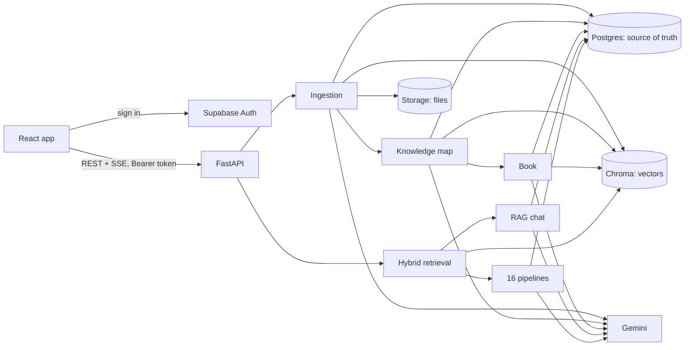

# How StudyForge works

A complete tour of the app: what it does, the tech stack, how the code is laid out, the data model, and what happens,
step by step, when you use each feature. Deeper references:
- [ARCHITECTURE.md](ARCHITECTURE.md): request flows with function names;
- [API.md](API.md): every endpoint;
- [DECISIONS.md](DECISIONS.md): why each choice was made;
- [LIVING_TEXTBOOK_PLAN.md](LIVING_TEXTBOOK_PLAN.md): the design of the book;
- [SETUP.md](SETUP.md): keys and running locally;
- [STUDY_GUIDE.md](STUDY_GUIDE.md): interview prep.

---

## 1. What the app does

A **notebook** is a course. You add **sources** to it: PDFs, Word files, text or Markdown, pasted notes, photos of
slides, recordings. StudyForge then gives you four things:

| Area | What you get |
|---|---|
| **Sources** | Upload or paste; each source is read, split into passages and indexed. A reader shows every passage. |
| **Book** (main tab) | One textbook per notebook, written from your sources and grown as you add more. |
| **Study tools** | 16 generators: summary, key concepts, FAQ, quiz, flashcards, exam notes, study guide, outline, mind map, glossary, timeline, practice problems, simple explanation, compare & contrast, podcast script, textbook chapter. |
| **Chat** | Answers only from your sources, citing each passage `[S1]` and each book section `[B1]`. |

What the book gives you:
- **Structure:** chapters in prerequisite order, a knowledge map of concepts, glossary hover.
- **Evidence:** an evidence rail beside every paragraph, a support check per paragraph, and where your sources disagree.
- **Figures:** concept maps, timelines, charts and comparison tables.
- **History:** "since you last read" and older versions of each section.
- **Export:** Markdown, EPUB, or print / save as PDF.
- **Learning tools:** reading progress, chapter quizzes feeding "weak spots", "explain this section", and search across all your notebooks.

---

## 2. Tech stack

| Layer | Technology | Version | Role |
|---|---|---|---|
| Frontend | React | 19.3 | UI |
| | Vite | 8.3 | dev server and build |
| | React Router | 7.18 | pages |
| | TanStack React Query | 5.104 | server state: caching, polling, mutations |
| | react-markdown + remark-gfm | 10.1 / 4.0 | safe Markdown (no raw HTML) |
| | Mermaid | 12.0 | mind maps, concept maps, timelines (loaded on demand) |
| | Supabase JS | 2.117 | sign-in; access token for API calls |
| | Vitest | 5.0 | unit tests |
| Backend | Python + FastAPI | 3.12 / 0.141 | REST + Server-Sent Events API |
| | Uvicorn | 0.54 | ASGI server |
| | Pydantic (+ settings) | 2.13 | request/response models, LLM output schemas, config from `.env` |
| | httpx | 0.28 | HTTP client (Supabase, with a stale-connection retry) |
| AI | Google Gemini `gemini-3.8-flash` | google-genai 2.25 | generation, extraction, verification, OCR, transcription (structured JSON output) |
| | Gemini `gemini-embedding-001` | 768-d | embeddings for passages, concepts, claims and book sections |
| | OpenAI (optional) | openai 3.20 | fallback LLM if Gemini is unavailable |
| Search | ChromaDB (embedded) | 1.5.9 | vector index (cosine HNSW), rebuildable from Postgres |
| | BM25 (in-process) | – | keyword retrieval, fused with dense via RRF |
| Data | Supabase Postgres | – | source of truth; row-level security on every table |
| | Supabase Auth | – | accounts and JWT access tokens |
| | Supabase Storage | – | original uploaded files (bucket `sources`) |
| Parsing | pymupdf / pymupdf4llm, python-docx | 1.28 / 1.2 | PDF → Markdown per page, DOCX |
| Quality | pytest, ruff | – | 155 backend tests (no API key needed), lint/format |
| CI | GitHub Actions | – | lint, test and build on every push |

**No Docker is needed locally.** Chroma runs embedded inside the API process. A multi-stage `Dockerfile` exists for deployment ([DEPLOY_GCP.md](DEPLOY_GCP.md)).

---

## 3. The big picture



Three rules hold everywhere:
1. **Postgres is the truth.** Chroma holds only vectors plus filter metadata and can be rebuilt (`scripts/reindex.py`).
2. **The backend checks ownership in code** (every route resolves the notebook through the signed-in user; other users' ids return 404).
   Row-level security protects direct database access too.
3. **Anything slow runs in the background** (FastAPI `BackgroundTasks`), and the UI polls a status or progress field.

---

## 4. Code layout

```
backend/
  app/
    main.py            app factory: routers, CORS, marks interrupted jobs failed at startup
    config.py          every setting (env vars / .env), with defaults
    services.py        builds the shared services: repo, storage, llm, embedder, vectors, bm25
    auth.py            verifies Supabase access tokens (cached 60 s); dev mode for local demos
    api/               HTTP routes: notebooks, sources, knowledge, book, generate, chat, me, health
    db/                repository interface + Supabase implementation + local JSON implementation
    ingest/            extract (PDF/DOCX/text/image/audio) -> chunk -> embed -> index
    retrieval/         scope, dense, keyword (BM25), fusion (RRF), MMR, LLM rerank, context assembly
    generation/        registry of the 16 pipelines, prompts, schemas, runner (cache, map-reduce)
    chat/              RAG chat: query rewrite, retrieval + book sections, streaming, citations
    knowledge/         the knowledge map: extraction, concept merge, claim triage (build.py, triage.py)
    book/              the book: outline, sync (stale -> write -> check), figures, export, learner tools
    llm/               Gemini + OpenAI clients, router/fallback, rate limits, JSON validation, call counting
    vector_store.py    Chroma wrapper (collections per kind and embedding model)
  migrations/          001_init ... 007_book_reader (run in order in the Supabase SQL editor)
  tests/               pytest; FakeLLM / FakeEmbedder / FakeVectorStore (no network, deterministic)
  eval/                retrieval evaluation (results.md) and the book support rate (book_support.md)
frontend/
  src/
    App.jsx            routes: landing + public pages, /login, /home, /notebooks, /notebooks/:id
    pages/             HomePage (desk + search), NotebooksPage, NotebookPage (the workspace), LoginPage
    components/        SourcesPanel, SourceReader, BookPanel, BookReader, BookDrawers, BookExtras,
                       StudioPanel + outputs/ (one view per format), ChatPanel, Modal, Toast
    lib/               api (fetch + auth), sse, glossary linking, citation matching, exports, formats
    styles/            tokens.css (design tokens) + base/app/workspace/outputs/landing CSS
  DESIGN.md            the "chalkboard and highlighter" design system
```

---

## 5. Data model (Postgres)

| Table | One row per | Key columns |
|---|---|---|
| `profiles` | user | email |
| `notebooks` | course | title, `sources_version` (bumped on every source change: invalidates caches) |
| `sources` | uploaded or pasted document | file name, type, SHA-256 (duplicate detection), status `uploaded → extracting → chunking → embedding → ready / failed` |
| `chunks` | passage (~600 tokens) | text, page, heading, token count; id = uuid5(source, index), so it's stable |
| `generations` | study-tool output | pipeline, params, output JSON, sources_version (cache key) |
| `chat_sessions` / `chat_messages` | conversation / message | content, rewritten query, citations |
| `concepts` | glossary term or named example | name, kind, definition, aliases, status current/conflicted |
| `concept_links` | relation | requires / part_of / contrasts_with |
| `claims` | atomic statement about a concept | text |
| `claim_evidence` | (claim, passage) pair | the same claim from 3 sources = 3 rows |
| `conflicts` | contradiction | the book's claim and the other source's statement + passage |
| `timeline_events` / `data_tables` | dated event / table of numbers from a passage | used for timelines and charts |
| `knowledge_jobs` | background job | kind extract/book, status, progress, detail, `llm_calls` |
| `books` | notebook's book | version |
| `book_sections` | section (outline + text) | chapter/section index, concept ids, paragraphs (text + passage ids + support), fingerprint, status, version, support rate, indexed |
| `book_section_versions` | saved text of a section per version | for version browsing |
| `book_changes` | book version | new concepts, added / revised / removed sections |
| `book_reads` | reader × notebook | last seen version, read sections, chapter quiz scores |
| `book_snapshots` | whole book at one version (last 5 kept) | for reverting the book |

Chroma collections, one set per embedding model:
- `chunks__…`: passages;
- `concepts__…`: for merging concepts;
- `claims__…`: for duplicate and contradiction checks;
- `sections__…`: book sections, for "ask the book" and search.

---

## 6. What happens when…

### …you add a source
1. The upload is accepted and the file is stored. Its SHA-256 is checked: the same file twice returns the existing source. The response is `202`.
2. **Background ingestion** (`ingest/pipeline.py`):
   - **Extract:** PDF pages become Markdown; scanned pages go through Gemini OCR; recordings are transcribed.
   - **Chunk:** a recursive, section-aware splitter makes ~600 tokens with 15% overlap. Each chunk keeps its page and heading.
   - **Embed and index:** a "Document / Section" header is added to each chunk before embedding, and the vectors go into Chroma.
   - The source becomes `ready`. The UI polls every 2 s while anything is processing.
3. **Knowledge map** (`knowledge/build.py`), 6 passages per Gemini call:
   - **Extract:** concepts, atomic claims, links, dated events and number tables.
   - **Merge concepts:** an exact name or alias match first. Otherwise the nearest existing concept by embedding (≥ 0.88) is checked by one batched Gemini "same or not?" call.
   - **Triage claims** against the 3 nearest claims of the same concept (one batched verdict call):
     - *same* → an extra evidence row on the existing claim;
     - *contradicts* → a conflict is recorded and the book's statement stays;
     - otherwise → a new claim.
   - A free-tier budget caps extraction at 150 passages an hour.
4. **Book** (`book/sync.py`):
   - **Outline:** the first time, it's planned from concept names and links only (prerequisites first). Later, only new concepts are placed.
   - **Stale sections:** each section's fingerprint hashes its concepts' definitions, claim texts and evidence. Only sections whose hash changed are rewritten.
   - **Write:** one Gemini call per stale section, from that section's own passages; every paragraph lists the passages it used.
   - **Support check:** one more call judges each paragraph against its passages. Unsupported paragraphs get one rewrite, then are kept with a mark.
   - **Reader settings:** the writer follows the book's settings (level: beginner, intermediate or advanced; depth: concise, standard or detailed; worked examples; code). Changing them rewrites the book.
   - **No repetition:** concepts that other sections teach are passed as "taught elsewhere", to be named but not explained again. Afterwards, a paragraph that overlaps another section's paragraph by 50% or more (word 3-shingles) is removed.
   - **Code and steps:** code blocks found in the section's passages are offered to the writer and kept with their passage. Code that isn't from the sources is labelled "illustrative". Ordered steps the passages describe become a flowchart, drawn by code.
   - **Save:** a snapshot of the text, a new book version, and a change record. The whole book is also snapshotted, and the last 5 snapshots are kept for "revert to this version". Written sections are embedded for search.
   - At most 150 section writes per notebook per day; sections over the cap are finished automatically when the day allows.

### …you open the Book tab
- `GET /book` returns everything the reader needs in one request:
  - numbered sections (2.3) and the book's settings;
  - contents with revised, read, disputed and support marks;
  - changes since your last visit;
  - concept map and timeline per chapter;
  - progress and weak spots.
- `GET /book/sections/{id}` returns the paragraphs with their evidence, comparison tables and charts.
- Glossary terms are linked in the browser (`lib/glossary.js`): longest name first, once per section.
- The toolbar opens:
  - the **Index** (`GET /book/index`): every term A–Z with its section numbers, bold where it is taught;
  - **History**, with "Revert to this version" for the last 5 editions (`POST /book/revert`);
  - **Book settings** (`PUT /book/settings`).
- Clicking an evidence chip opens the source reader at that passage, with the matching sentence highlighted.

### …you ask the chat
1. A follow-up question is rewritten into a standalone question.
2. **Six-layer retrieval:**
   - scope (notebook, sources, pages);
   - dense search (Chroma) and BM25 (keywords);
   - Reciprocal Rank Fusion;
   - MMR (removes near-duplicates);
   - LLM rerank;
   - a token-budgeted context labelled `[S1]…`.
3. **Ask the book:** the 2 book sections closest in meaning (embedding similarity plus a word-match bonus) are added as `[B1]`, `[B2]`.
4. Gemini streams the answer over SSE. Only the citations the answer actually uses are saved.
5. In the UI, `[S#]` opens the source passage and `[B#]` opens the book section.

### …you generate a study tool
- One runner serves all 16 pipelines. Each pipeline has:
  - a retrieval strategy: the whole notebook with map-reduce, top-k retrieval, or per source;
  - a Pydantic schema, sent to Gemini as the response schema. The output is validated and repaired once if needed.
- Difficulty, length and focus topic change the prompt.
- Results are cached by (notebook, pipeline, params, sources_version).
- "Quiz me on this chapter" is the quiz pipeline with the chapter as its focus topic. The first full attempt's score goes to `book_reads`.

### …you search every notebook
- `GET /search` embeds the query once and searches the concepts and sections collections across **only your** notebooks. It adds a bonus for exact word matches.
- Each result links to `?concept=` (opens the concept drawer) or `?section=` (opens the book at that section).

---

## 7. Reliability and cost controls

| Concern | What the app does |
|---|---|
| Gemini rate limits | client-side rate limiter (`gemini_rpm`), retries with backoff, optional OpenAI fallback |
| Free-tier cost | 150 extraction passages/hour; 150 section writes/notebook/day (waiting sections resume by themselves); Gemini calls counted per job and shown |
| Wasted work | cached generations; sections rewritten only when their fingerprint changes; one source can be re-read without a full rebuild |
| Hallucination | answers and paragraphs cite passages; concepts without evidence are left out of the book; support check with visible marks (95% supported on the real test notebook, a self-check) |
| Disagreeing sources | recorded as conflicts with both passages; never silently overwritten |
| Dropped connections | Supabase requests resent once on "Server disconnected" |
| Restarts | jobs still "running" at startup are marked failed; the next sync rewrites what was left stale |
| Chroma internal errors | a failed filtered query falls back to an exact search over the filtered vectors |
| Untrusted model output | Markdown rendered without raw HTML; Mermaid in strict mode; diagram labels sanitised; JSON validated against schemas |

---

## 8. Running, testing, evaluating

```bash
# backend (from backend/)
.venv/Scripts/python -m uvicorn app.main:create_app --factory --port 8080
# frontend (from frontend/)
npm run dev          # http://localhost:5173
# tests
cd backend && .venv/Scripts/python -m pytest      # 155 tests, no API key
cd frontend && npm test                            # 30 tests
# evaluation
cd backend && .venv/Scripts/python eval/run_eval.py                    # retrieval quality -> eval/results.md
cd backend && .venv/Scripts/python eval/book_support.py <notebook_id>  # book support rate -> eval/book_support.md
```

Configuration lives in `backend/.env` and `frontend/.env` (git-ignored; names in the `.env.example` files).
New Supabase projects run `backend/migrations/001` to `007` in order.
Deploying (backend Docker image, frontend on GitHub Pages, the index rebuilt from Supabase on hosts without a persistent disk): [DEPLOY.md](DEPLOY.md).

---

## 9. Measured on a real notebook (2026-09-29)

"DBMS revision": an OS lecture plus DBMS notes on transactions and indexing, with real Supabase and Gemini.

**How the book grew:**
- First edition: 16 concepts → 2 chapters, 7 sections.
- Adding the transactions notes: 6 of 7 sections untouched, 1 revised, a new 4-section chapter.
- Adding the indexing notes: all 11 sections untouched, a new 5-section chapter (11 Gemini calls).
- Adding a note with dates and a table: 3 new sections, 2 revised, 14 untouched.
  - The new chapter got a timeline (1970 → 1986).
  - The table became a bar chart of page reads per lookup (10000 / 4 / 1).

**Quality and features:**
- **Support check:** 37 of 39 paragraphs backed by their own passages (95%), 2 partial, 0 unsupported.
- **Figures:** a concept map for all 4 chapters, and 12 comparison tables.
- **Export:** Markdown, and a valid EPUB of 27 KB.
- **Chat** cited both `[S1]` and `[B1]`.
- **Search by meaning:** "two processes stuck waiting on each other forever" found *Deadlock Basics* first.
- **Chapter quiz:** a score of 1/5 became a weak spot.
- **Retrieval evaluation:** `eval/results.md` (the LLM rerank layer took Recall@1 from 0.82 to 1.00 on 33 labelled questions).
